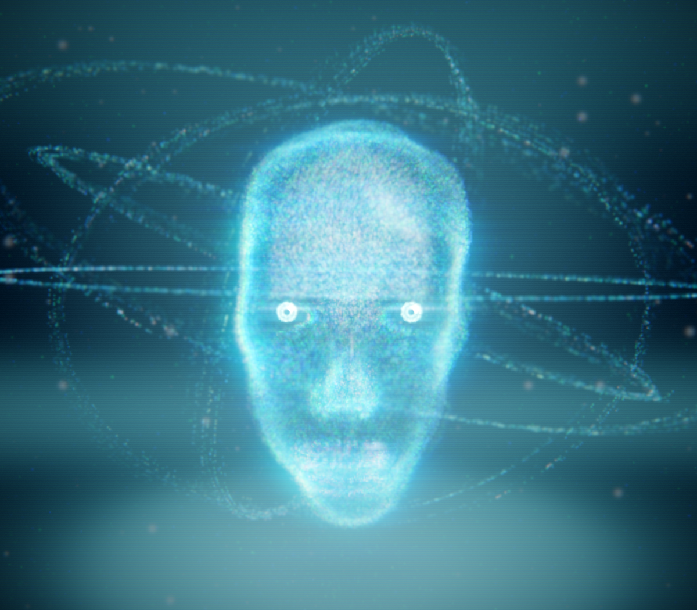
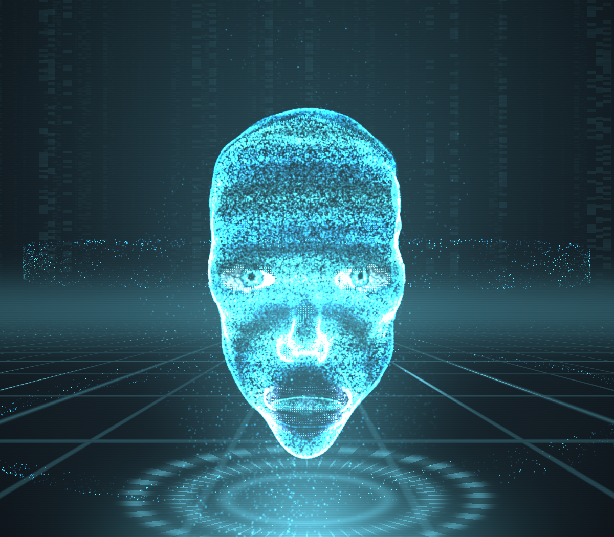
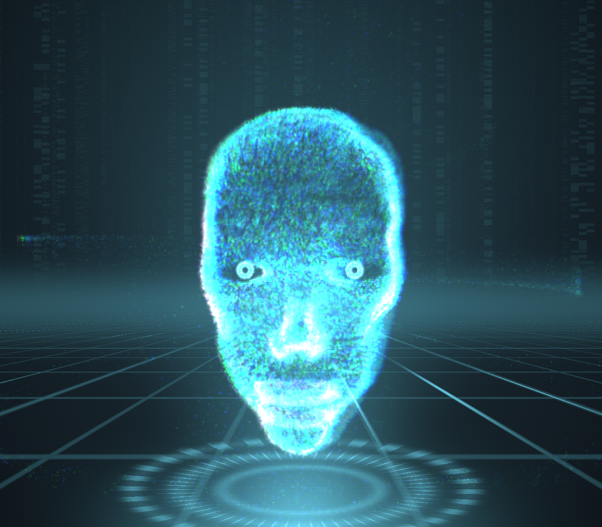
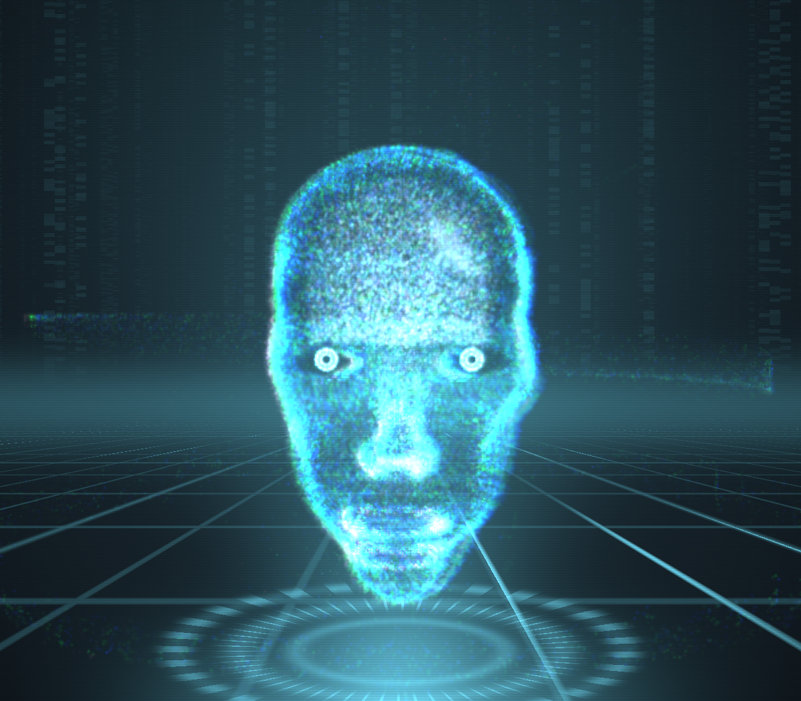
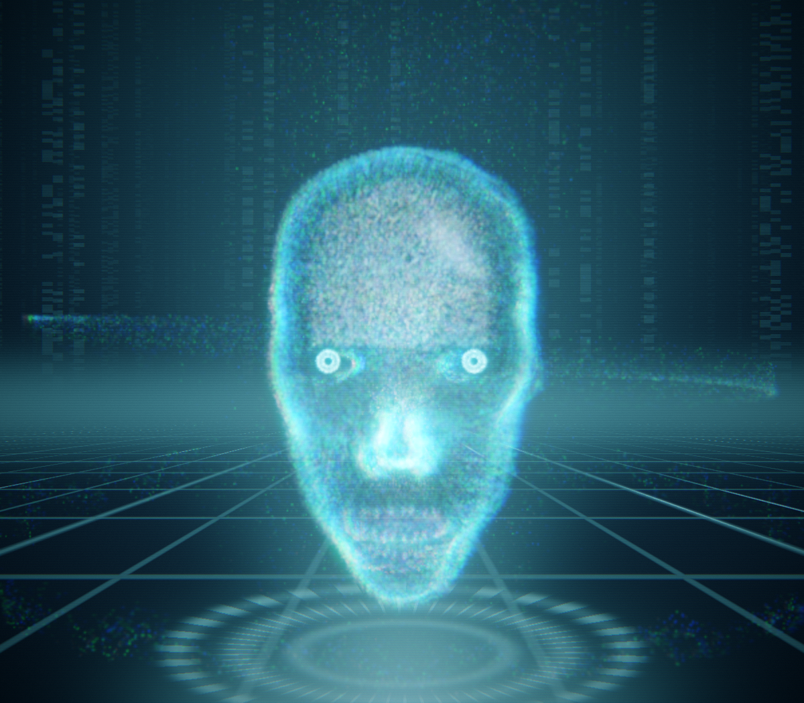
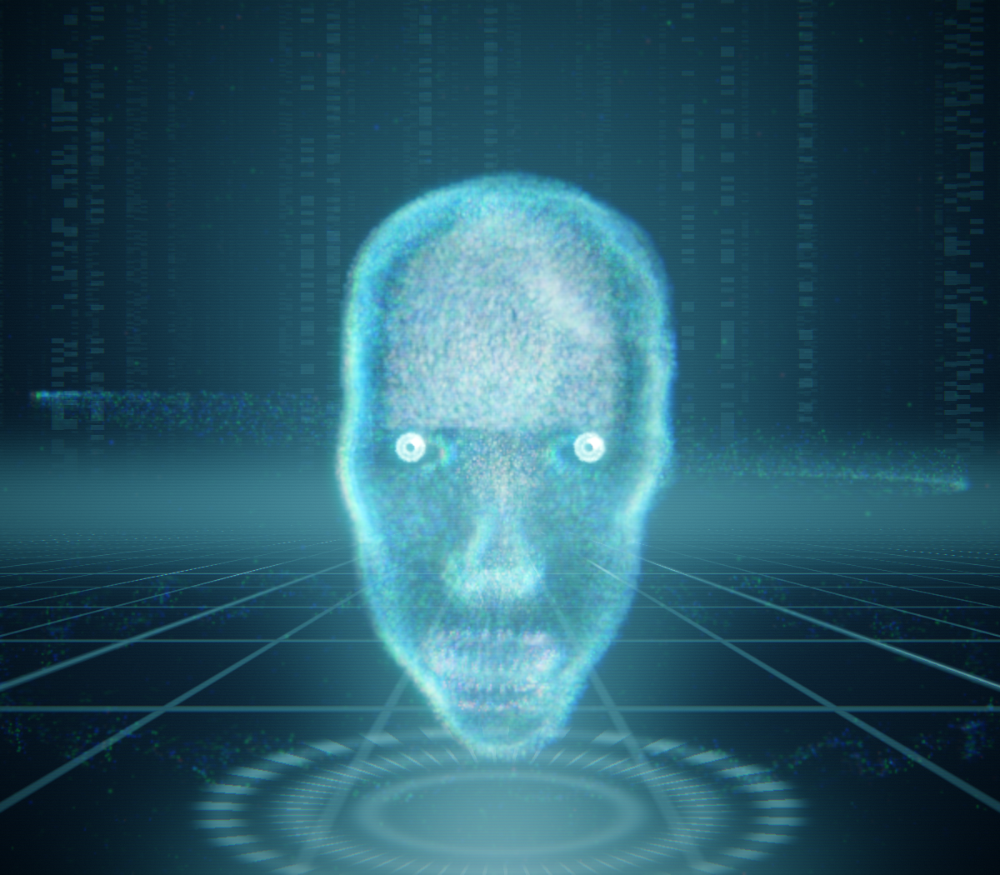

# FABLEFACE — a configurable synthetic presence

Live at **https://fableface.purh.pw** — a real-time, talking, human-like AI face
rendered from one procedurally defined head (a GLSL signed distance function:
skull, brow, articulated jaw, lips with an oral cavity, eyelids that blink). The
default face is **WISP VIII "ANIMA"** — a fully configurable additive hologram:
every effect is a live knob, reachable from the **⚙ TUNE** panel or the
`FableFace.setParam()` / `preset()` API (see [Configure the look](#configure-the-look)).

It headlines a lineage of eight WISP renderers, and the repo also keeps several
purpose-built heads — all derived from the *same* SDF:

| Face | Technique | Notes |
|---|---|---|
| **EVE** | Shared head, paneled-shell raymarch | human-like android: ivory shell segmented by a structured plate-line network that glows teal with speech |
| **RONIN** | Dedicated hard-surface raymarch | industrial mech: plated armor, panel gaps, lens eyes w/ shutter blinks, hinged jaw, voice bar, curvature edge-wear |
| **SONNY** | Dedicated SDF raymarch | NS-5 (I, Robot 2004) tribute head: milky face plate, translucent cranium, cable neck |
| **ORACLE** | Pure SDF raymarching (no triangles) | the shared head; the distance field itself deforms |
| **WISP** | 90k additive GPU point sprites | forward warp per particle; hologram scanlines |
| **VESSEL** | Surface-Nets mesh (~130k tris) + wireframe | forward warp in the vertex shader |

The mesh and particles are derived from the *same* SDF at load: the field is
evaluated on the GPU into a 160×208×120 grid (packed 16-bit distances + material
ids, one readPixels), triangulated in JS with naive Surface Nets, and the
particle cloud is area-uniform sampled from those triangles. So all three are
provably the same head.

## Gallery

**WISP VIII "ANIMA"** — the configurable default, shown in the new **Chamber II**
arena with an orrery of motes orbiting the head:



It takes the PORTRAIT pipeline further on every axis — a wider two-octave bloom, a
new anamorphic lens streak, a themeable base colour, a stronger portrait key and
brighter catchlights — and exposes all of it as live config (see below).

### The lineage that led here

Eight generations of the *same* SDF head; only the rendering evolves — each
version adds a layer of craft on the one before it.

| | | |
|:-:|:-:|:-:|
|  |  |  |
| **WISP** · particle hologram | **WISP II** · feature-dense + emotion recolor | **WISP III** · trails + tech-iris |
|  |  |  |
| **WISP IV** · *Signal Being* — fresnel glass, cortical storms | **WISP V** · *Glass Mind* — skin / circuit / brain-core anatomy | **WISP VI** · *Cinema Engine* — HDR, bloom, ACES grade |
|  | | |
| **WISP VII** · *Portrait* — production key light, catchlights | | |

*Captured headless under software GL (SwiftShader). The raymarched glass shell
and HDR bloom are fps-adaptive, so the later versions are noticeably richer on a
real GPU — see the live site.*

## Configure the look

WISP VIII promotes ~30 formerly-hardcoded effects to live parameters. Adjust them
in the **⚙ TUNE** panel (grouped sliders / colour / toggles + preset chips) or
drive them from the SDK — settings persist in `localStorage`:

```js
FableFace.setParam('bloom', 0.9);          // one knob
FableFace.setConfig({ baseCol: [1, 0.6, 0.2], anamorphic: 0.8 }); // several
FableFace.preset('cinematic');             // anima · cinematic · hologram · neon · vivid · minimal · amber
FableFace.getConfig();                     // read the current look
FableFace.resetConfig();                   // back to defaults
FableFace.listConfig();                    // full schema (groups, ranges, presets)
```

Groups: **Cinema** (exposure, bloom + threshold, anamorphic streak, chromatic
aberration, grain, vignette, saturation, contrast, teal/orange), **Hologram**
(base colour, scanlines, trail persistence, RGB separation, particle size, skin
opacity), **Light** (key, rim/fresnel, warm counter-rim, catchlights, iris),
**Life** (motion, breathing, cortical storms, voice resonance, coherence
shimmer, sparkle), **Depth** (depth-of-field, fog), and **Toggles** (glass
shell, scene rings, floor reflection).

## Scenes

Two rooms, both chamber-family:

- **Chamber II** *(default)* — a soft luminous stage: volumetric key beams, a
  glowing pedestal, soft concentric rings and drifting motes, with an **orrery**
  of orbital particles sweeping around the head. No hard grid; it renders at the
  same fidelity as the face.
- **Chamber** — the original holo-room: perspective grid floor, data walls and a
  rotating instrument dais.

Switch with the SCENE chips, `FableFace.setScene('chamber2'|'chamber')`, or
`?scene=`.

## Liveness

`driver.js` (DOM-free, node-testable) produces the presence signal: Poisson
blinks, gaze saccades + pointer pursuit, head wander/nods, breathing, moods, and
a rectified-sine syllable oscillator for lip-sync. `speech.js` uses the Web
Speech API when the browser has voices and otherwise *mimes* the speech visually
for an estimated duration — the faces always talk, even on headless boxes.

## Run / deploy

```sh
docker compose up -d --build     # container "fableface" on 127.0.0.1:8799
```

Host nginx conf: `/home/ai/infra/nginx/sites/fableface.purh.pw.conf`
(certbot cert `fableface.purh.pw`, webroot `/var/www/certbot`).

## Tests

```sh
# pure logic (driver, surface nets, sampling, speech mime): 7k+ asserts
docker run --rm -v "$PWD":/app:ro -w /app node:22-alpine node test/smoke.mjs

# visual: screenshots each face idle+talking to shots/, fails on console errors
cp test/shots.mjs /tmp/ffshots/ && \
docker run --rm --network=host -v /tmp/ffshots:/work -v "$PWD"/shots:/shots \
  -w /work mcr.microsoft.com/playwright:v1.49.0-noble node shots.mjs
# (first time: docker run ... npm i playwright@1.49.0 in /tmp/ffshots)
```

`window.__fableface` exposes `{driver, speech, select(face), assets}`;
`driver.override = {jaw: 0.7}` holds a deterministic pose for screenshots.

## Layout

```
site/js/headsdf.js    THE shared head: GLSL SDF + forward warp + eye shader
site/js/gridmesh.js   GPU field eval → Surface Nets → surface sampling
site/js/face-eve.js   EVE     (shared head + structured plate-line shell)
site/js/face-ronin.js RONIN   (dedicated hard-surface mech head, raymarch)
site/js/face-ns5.js   SONNY   (dedicated NS-5 head, raymarch)
site/js/face-ray.js   ORACLE  (raymarch)
site/js/face-dots.js  WISP    (particles)
site/js/face-mesh.js  VESSEL  (mesh)
site/js/driver.js     presence signal (pure logic)
site/js/speech.js     TTS / mime
site/js/main.js       boot, camera, UI
```

## WISP II — the feature-dense emotional hologram (default face)

WISP's successor. Same additive-particle language, four upgrades:
feature-weighted sampling (the 96k-particle budget follows the expression —
eyes, lips, brows, nose at 2–3× density), ~9k crisp **contour particles**
tracing feature lines extracted from smooth-normal curvature + material
boundaries, and a full hologram effect stack: data streams feeding the
projection from the emitter, two counter-rotating dashed orbit rings, floor
reflection, voice ripples radiating from the mouth, pedestal ring with rotating
ticks — and **emotion recoloring**: the whole projection lerps its hue with the
companion's emotional state (angry = red, love = magenta, joy = gold, thinking
= deep blue) while the eyes hold cyan for contrast. Startle it (`poke()`) and
it glitch-bursts (band displacement + chroma split via the driver's `reactW`).

## WISP VII — PORTRAIT (production face)

Directional portrait key (lit side carries the form), amber counter-rim (teal-orange
discipline), catchlights in the irises (pushed above the bloom threshold so they
sparkle), thin-film grazing iridescence, quiet nose, 85mm-style long-lens framing
(22° FOV, camera pulled back), split-toned grade (teal shadows / warm highlights),
eyes-ignite-last entrance. Inherits the full CINEMA ENGINE (HDR/bloom/ACES/grade),
GLASS MIND anatomy, and the chamber scenes. (WISP VIII supersedes it as the default.)

## The mathematics of being alive (research round)

The motion layer is built from published math, not ad-hoc sines — see
`docs/math-research-2026-07.md` for formulas and sources:

- **Kuramoto coherence** — 24 real phase oscillators run in the driver; the new
  `coh` emotion channel sets the coupling and the order parameter *emerges*.
  Calm/confident minds shimmer in unison; confusion visibly scintillates apart
  (plus a Thomas-attractor drift that only appears when coherence collapses).
- **Ornstein-Uhlenbeck gaze** with Poisson microsaccades (exact discretization,
  tuned to fixational-eye-movement statistics) — replaces periodic sine wander.
- **1/f pink breathing** — octaved-sine pink noise modulates breath rate/depth;
  biological rhythms are 1/f, periodic reads as robotic.
- **Chladni voice resonance** — a 3D standing-wave field intersects the skin as
  nodal lines that glow while antinodes vibrate, mode laddered by voice level:
  the face is the resonating instrument of its own voice.
- **Spherical-harmonic silhouettes** — five Y_lm coefficients give each emotion
  a *shape* (droop, lean, swell, stretch, sparkle), springs + incommensurate
  LFOs so the body language never loops.
- **Loxodromic Möbius stream** — the ambient dust orbits on the conformal flow
  of the sphere (circles map to circles): elliptic when calm, pole-to-pole
  spirals when excited.
- **Divergence-free tangent flow** — surface streams are a true 2D curl of a
  noise potential (Bridson): coherent rivers that never clump.

## Simulated operator (the right panel)

The page ships its own live demo: a scripted conversation between a **simulated
operator** and the face, driven entirely through the public `FableFace.*` API —
states (`listening` while the operator types, `thinking` with the acknowledgment
nod, then speech), streamed replies via `sayStream`, inline emotion/gesture cues,
scene changes and sleep/wake. Every `emotionchange` / `gesture` /
`scenechange` event the SDK emits is rendered as a chip in the transcript the
instant it fires, and the reply text reveals word-by-word in sync with the
actual `word` events of the voice — what you read is literally what the SDK is
doing at that moment. Human-paced throughout: jittered operator typing with a
live caret, a thinking-dots bubble masking simulated LLM latency, entrance
animations, and smooth near-bottom-only autoscroll. Auto-starts ~9 s
after load (skipped in `?embed=1`; disable with `?sim=0`); manual SPEAK stops
it; hidden below 1180 px width. Source: `site/js/simulation.js`.

## Production integration (the agent loop)

**Streaming speech** (the way an LLM should drive it):
```js
FableFace.on('speechend', () => {/* continue the conversation loop */});
FableFace.on('speechinterrupted', e => {/* truncate LLM history: e.spokenWords */});
FableFace.setState('listening');           // user talks (feed FableFace.listen(level))
FableFace.setState('thinking');            // turn ended → instant ack nod plays
for await (const token of llmStream) FableFace.sayStream(token);
FableFace.sayStream('', { done: true });   // sentences speak as they complete;
                                           // first chunk flushes aggressively (<~500ms)
```
**Event contract** (window `.on()`, parent postMessage, WebSocket — one schema):
`ready · statechange · emotionchange · gesture · scenechange · speechqueued ·
speechstart · word · speechend · speechinterrupted`.

**Hardening**: WebGL context-loss recovery (auto-reacquire), tab-visibility pause,
`?quality=low` tier (DPR cap; the raymarch shell is fps-adaptive everywhere),
thinking-watchdog (a dead backend can never freeze the face — 30s → idle),
autoplay-safe TTS with gesture unlock, `perform()` timeline choreography.
Latency posture per voice-agent research: reaction <200ms (local ack), first
audio <800ms (Web Speech tier), interrupt → silence immediate + freeze beat.
## Companion API (v2 — emotion engine)

FABLEFACE is an embeddable AI-companion face. **24 blendable emotions** (joy, delight,
warm, love, proud, mischievous, awe, sad, angry, irritated, fear, disgust, embarrassed,
curious, confused, thinking, skeptical, determined, concerned, surprise, bored, sleepy,
alarm, neutral), **13 gestures** (nod, nod2, shake, tilt, wink, gasp, laugh, sigh,
eyeroll, wince, alert, bow, lookup), **companion states** (idle / listening / thinking /
sleeping / alert) with distinctive behavior (thinking = up-glances + glow pulse;
listening = locked gaze + "mhm" nods on utterance ends; sleeping = closed lids + slow
breath), transient reactions, autopilot idle arc (bored → sleepy → asleep, poke to wake),
micro-expressions, emotional pupil dilation + glow channels.

### Three transports, one command set

```js
// 1. same page
FableFace.setEmotion('joy', 0.8);
FableFace.emote('nod');
FableFace.setState('thinking');            // while your LLM works
FableFace.say('[joy] Done! [nod] It worked.', { auto: true });
FableFace.listen(0.7);                     // user is speaking (mic level 0..1)
FableFace.lookAt(0.3, 0.1); FableFace.poke(); FableFace.sleep(); FableFace.wake();
FableFace.setAutopilot(false);             // backend takes full control
FableFace.list(); FableFace.status();

// 2. iframe embed  (https://fableface.purh.pw/?embed=1&face=eve&autopilot=0)
iframe.contentWindow.postMessage({ ff: true, cmd: 'say', args: ['[warm] Hello!'], id: 1 }, '*');
// replies: {ff:true, id:1, result, error}

// 3. WebSocket backend  (?ws=wss://your-companion/face)
// server sends {cmd:'setState', args:['thinking']} JSON messages; face pushes
// {event:'ready', ...status} on connect. Connecting disables autopilot.
```

Speech supports inline cue tags word-synced in both TTS and mime mode:
`[emotion]`, `[emotion:0.6]`, `[gesture]`, `[reset]` — plus automatic heuristics
(questions → curious, "sorry" → concerned, "haha" → laugh, "!" → nod, "…" → thinking).

URL params: `?face=&emotion=&intensity=&state=&embed=1&autopilot=0&say=&ws=`.

Typical LLM loop: `listen(level)` while the user talks → `setState('thinking')` during
inference → `say(replyWithTags)` → back to `idle` (the face handles the rest itself).
